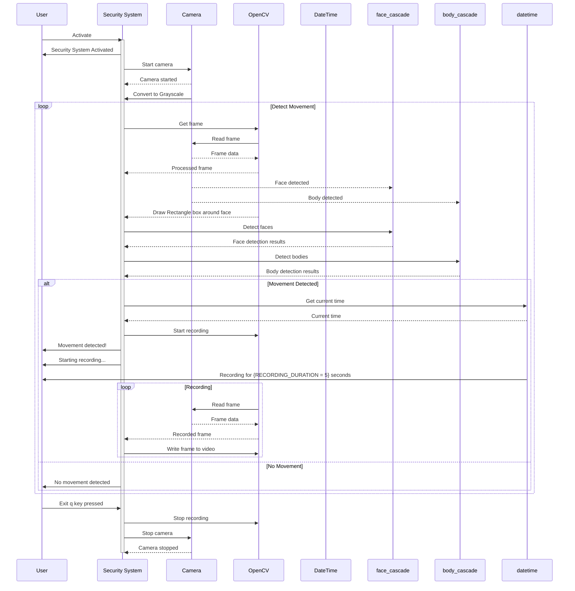

# Security System with OpenCV

This Python script implements a motion detection system using OpenCV. It captures video from the default camera, detects faces and bodies using Haarcascades, and records video when motion is detected. The recording stops after a specified period of no motion detected and saves recored videos with the date and time.


## Documentation

This Python Script implements a motion detection system using OpenCV.
It captures video from the default camera, detects faces and bodies using Haarcascades,
and records video when motion is detected. The recording stops after a specified period
of no motion detected.

**Key Functionalities:**

* Accesses the default webcam.
* Employs Haarcascades for face and body detection.
* Initiates video recording upon detection and continues for a specified duration after the last detection.
* Displays a live feed with bounding boxes around detected faces.
* Allows for termination using the 'q' key.

**Limitations:**

* Relies on pre-trained Haarcascades, which might have limitations in accuracy and robustness.
* Records continuously upon detection, which could lead to large video files. More sophisticated motion detection could be implemented for efficiency.
* Lacks features like email or cloud storage integration for recordings.

**Usage:**

* Ensure you have OpenCV installed (`pip3 install opencv-python`).
* Run the script. The live feed will display on your screen.
* Press 'q' to quit the application.

**Sequence Diagram:**



## Installation

Clone the repository or download the script:

```bash
  git clone https://github.com/vaidehiadhi/security_system.git
```
Navigate to the project directory:
```bash
cd security_system
```
Create a virtual environment (optional but recommended):
```bash
python3 -m venv venv
source venv/bin/activate
```
Install the required dependencies mentioned in the requirements.txt file 
```bash
pip install -r requirements.txt
```

    
## Usage

Run the script using the following command:
```bash
python security_system.py
```
The live feed will display on your screen, and recording will start when motion is detected.

Press 'q' to quit the application.


## Authors

- [@vaidehiadhi](https://www.github.com/vaidehiadhi)


## License

[MIT](https://choosealicense.com/licenses/mit/)

